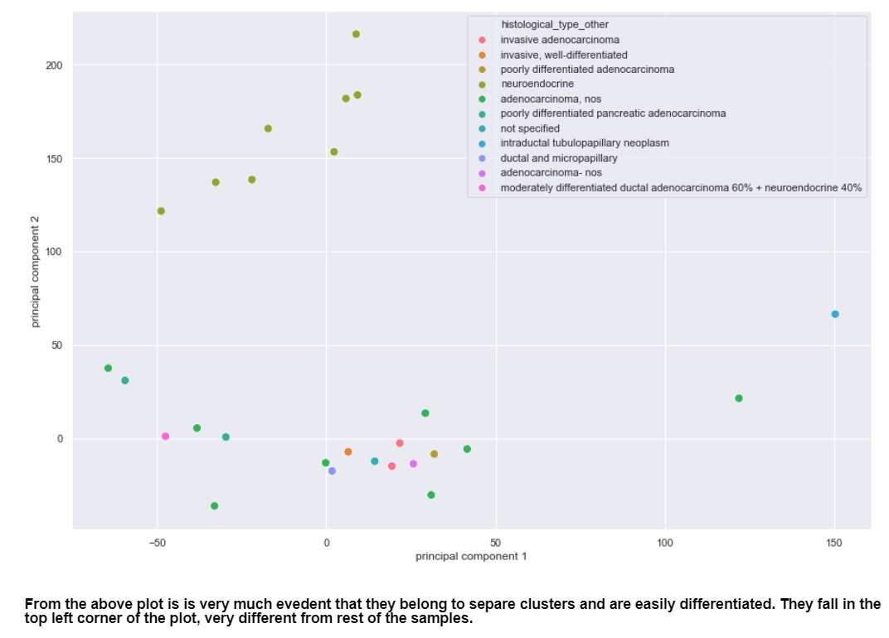

# gene-expression-profiling
Gene expression profiling can also be used to more accurately classify tumors and understand the heterogeneity within a cancer type.

 
<b>RNA-Sequencing</b> is a high-throughput method for gene expression profiling - measuring the expression of genes in a sample and revealing the presence and quantity of RNA in a biological sample. In the context of cancer, gene expression profiling can also be used to more accurately classify tumors and understand the heterogeneity within a cancer type. 
 
 

we will work with a gene expression dataset of Pancreatic Adenocarcinoma. Pancreatic Adenocarcinoma (PAAD) is the third most common cause of death from cancer, with an overall 5-year survival rate of less than 5%, and is predicted to become the second leading cause of cancer mortality in the United States by 2030.

